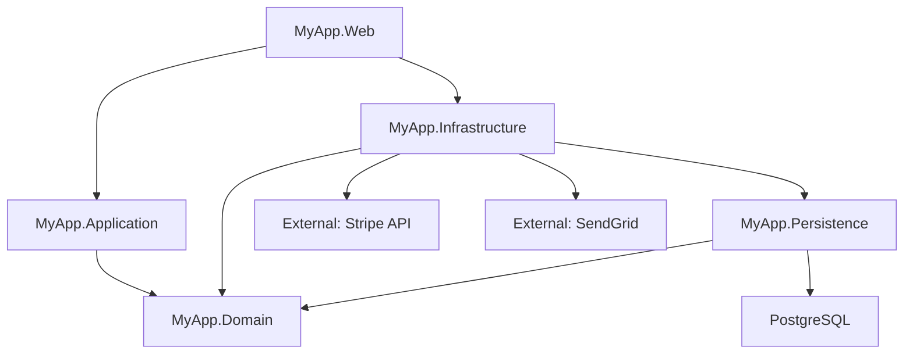

# System Assessment Reference

> **Load when:** Performing code analysis, dependency mapping, or risk scoring for legacy systems.

## Dependency Mapping

### Automated Analysis Tools

```bash
# .NET dependency analysis
dotnet list package --include-transitive
dotnet list package --outdated
dotnet list package --vulnerable

# Project reference graph
dotnet list reference  # per project
# Or use solution-level analysis:
dotnet sln list        # list all projects in solution

# NuGet package dependency tree (Visual Studio)
# Tools → NuGet Package Manager → Package Manager Console
Get-Package | Format-Table Id, Version, ProjectName
```

### Dependency Graph Generation

```csharp
// Analyze project references programmatically with Roslyn
using Microsoft.Build.Locator;
using Microsoft.CodeAnalysis.MSBuild;

MSBuildLocator.RegisterDefaults();
using var workspace = MSBuildWorkspace.Create();
var solution = await workspace.OpenSolutionAsync("MyApp.sln");

foreach (var project in solution.Projects)
{
    Console.WriteLine($"Project: {project.Name}");
    foreach (var reference in project.ProjectReferences)
    {
        var refProject = solution.GetProject(reference.ProjectId);
        Console.WriteLine($"  → {refProject?.Name}");
    }
}
```

### Mermaid Dependency Diagram

Generate architecture diagrams for documentation:



## Technical Debt Scoring

### Debt Assessment Matrix

Rate each component on a 1-5 scale for each dimension:

| Dimension | Score 1 (Low Risk) | Score 5 (High Risk) |
|---|---|---|
| **Coupling** | Isolated, interface-based | Tightly coupled, concrete deps |
| **Test Coverage** | >80% meaningful tests | <10% or no tests |
| **Change Frequency** | Rarely changed | Changed weekly |
| **Business Criticality** | Internal tooling | Revenue-critical path |
| **Tech Currency** | Current framework | EOL framework/library |
| **Complexity** | Simple, linear | High cyclomatic complexity |
| **Documentation** | Well-documented | No docs, tribal knowledge |

**Priority Score Formula:**
```
Priority = (Coupling + Complexity) × Business_Criticality × Change_Frequency / Test_Coverage
```

Higher score = higher priority for modernization.

### Example Assessment

```markdown
| Component | Coupling | Tests | Changes | Critical | Tech | Complexity | Priority |
|---|---|---|---|---|---|---|---|
| Payment Processing | 4 | 2 | 5 | 5 | 3 | 4 | **HIGH** |
| User Management | 2 | 3 | 2 | 3 | 2 | 2 | Low |
| Escrow Engine | 5 | 1 | 4 | 5 | 4 | 5 | **CRITICAL** |
| Reporting | 3 | 4 | 1 | 2 | 2 | 3 | Low |
| Notifications | 2 | 3 | 3 | 3 | 3 | 2 | Medium |
```

## Code Quality Metrics

### Static Analysis with dotnet-format and Analyzers

```xml
<!-- Directory.Build.props — Enable analyzers across all projects -->
<PropertyGroup>
    <AnalysisLevel>latest-all</AnalysisLevel>
    <EnforceCodeStyleInBuild>true</EnforceCodeStyleInBuild>
    <TreatWarningsAsErrors>true</TreatWarningsAsErrors>
</PropertyGroup>

<ItemGroup>
    <PackageReference Include="Microsoft.CodeAnalysis.NetAnalyzers" Version="9.*" />
    <PackageReference Include="SonarAnalyzer.CSharp" Version="10.*" />
    <PackageReference Include="Roslynator.Analyzers" Version="4.*" />
</ItemGroup>
```

### Complexity Analysis

```bash
# Count lines of code per project (rough metric)
find src/ -name "*.cs" | xargs wc -l | sort -n

# Count public methods per class (SRP indicator)
rg "public\s+(async\s+)?[\w<>\[\]]+\s+\w+\s*\(" src/ --count | sort -t: -k2 -n -r

# Find large files (complexity indicator)
find src/ -name "*.cs" -exec wc -l {} \; | sort -n -r | head -20

# Find deeply nested code (nesting > 3 levels)
rg "^\s{16,}\S" src/ --glob "*.cs" --count | sort -t: -k2 -n -r
```

## Bounded Context Identification

### Event Storming (Simplified)

Identify bounded contexts by analyzing business events and commands:

```markdown
## Domain Events (What happened)
- EscrowCreated
- EscrowFunded
- EscrowReleased
- EscrowDisputed
- PaymentProcessed
- PaymentFailed
- UserRegistered
- UserVerified
- NotificationSent

## Commands (What triggers events)
- CreateEscrow → EscrowCreated
- FundEscrow → EscrowFunded, PaymentProcessed
- ReleaseEscrow → EscrowReleased, PaymentProcessed
- DisputeEscrow → EscrowDisputed, NotificationSent

## Bounded Context Clusters
1. **Escrow Management** — CreateEscrow, FundEscrow, ReleaseEscrow, DisputeEscrow
2. **Payment Processing** — PaymentProcessed, PaymentFailed, Refunds
3. **Identity & Access** — UserRegistered, UserVerified, Authentication
4. **Notifications** — NotificationSent, Templates, Channels
```

### Database Table Clustering

Analyze which tables are accessed together to identify context boundaries:

```sql
-- PostgreSQL: Find tables that are frequently joined together
-- (Indicates they belong to the same bounded context)
SELECT
    schemaname || '.' || relname AS table_name,
    seq_scan + idx_scan AS total_scans,
    n_tup_ins AS inserts,
    n_tup_upd AS updates
FROM pg_stat_user_tables
ORDER BY total_scans DESC;

-- Analyze foreign key relationships to find clusters
SELECT
    tc.table_name AS child_table,
    ccu.table_name AS parent_table,
    tc.constraint_name
FROM information_schema.table_constraints tc
JOIN information_schema.constraint_column_usage ccu
    ON tc.constraint_name = ccu.constraint_name
WHERE tc.constraint_type = 'FOREIGN KEY'
ORDER BY parent_table, child_table;
```

## Risk Assessment Template

```markdown
# Migration Risk Assessment

## Component: {Name}

### Technical Risks
| Risk | Probability | Impact | Mitigation |
|---|---|---|---|
| Data loss during migration | Low | Critical | Dual-write + verification |
| Performance regression | Medium | High | Load testing before cutover |
| Integration breakage | Medium | High | Contract tests at boundaries |
| Incomplete test coverage | High | Medium | Characterization tests first |

### Organizational Risks
| Risk | Probability | Impact | Mitigation |
|---|---|---|---|
| Team unfamiliar with new tech | Medium | Medium | Training + pair programming |
| Scope creep | High | Medium | Fixed scope per phase |
| Business pressure to skip testing | Medium | High | Automated gates in CI/CD |

### Recommended Approach
- **Strategy:** {Strangler Fig / Branch by Abstraction / Feature Flag}
- **Estimated Duration:** {weeks}
- **Team Required:** {roles and count}
- **Go/No-Go Criteria:** {measurable conditions for cutover}
```
